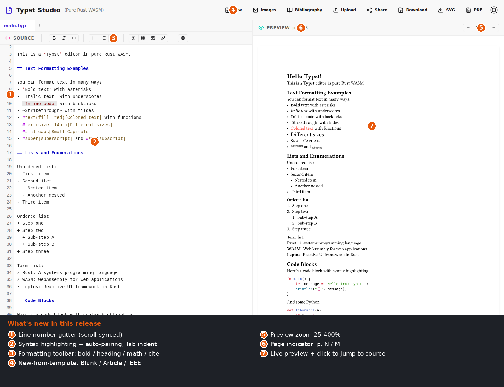
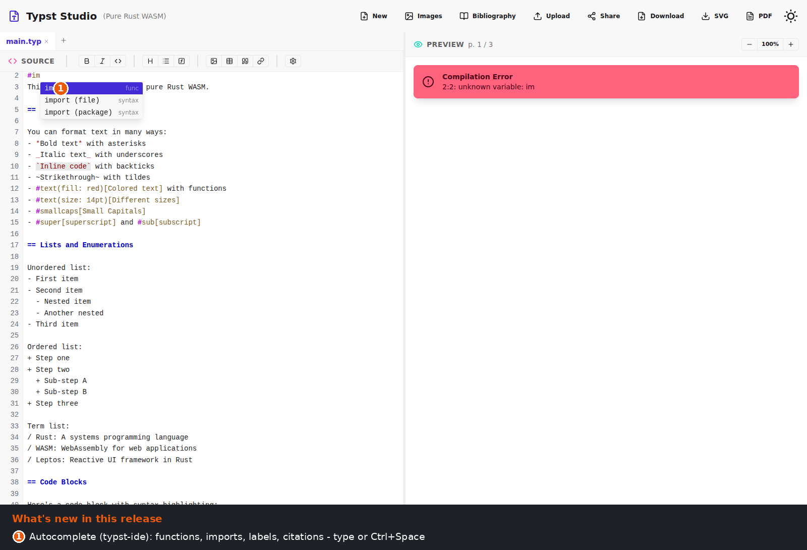

<p align="center">
  
</p>

<h1 align="center">Typst Studio</h1>

<p align="center">
  A fully client-side <a href="https://typst.app">Typst</a> editor written in Rust and
  compiled to WebAssembly — with live preview, syntax highlighting, and autocomplete.
  <br />
  Runs in the browser or as a native desktop app, from a single codebase.
</p>

<p align="center">
  
  
  
  
  
  
</p>

<p align="center">
  
</p>

Compilation, storage, and rendering all happen in the browser; there is no backend. The
same crate ships as a desktop application through [Tauri](https://tauri.app), so the web
and native builds share one source tree.

## Table of Contents

- [Features](#features)
- [Tech Stack](#tech-stack)
- [Getting Started](#getting-started)
- [Building for Production](#building-for-production)
- [Usage](#usage)
- [Project Structure](#project-structure)
- [Configuration](#configuration)
- [Known Limitations](#known-limitations)
- [Contributing](#contributing)
- [License](#license)
- [Acknowledgments](#acknowledgments)
- [Resources](#resources)

## Features

**Editing**

- **Live preview** — Typst is recompiled as you type, with results rendered to SVG.
- **Syntax highlighting** — VS Code Dark+ theme with comprehensive Typst coverage.
- **Code editor** — line-number gutter, native undo/redo, bracket and quote auto-pairing, and `Tab` / `Shift+Tab` block indentation.
- **Autocomplete** — context-aware completions via `typst-ide` (functions, labels, citations, packages). Type to filter, or trigger explicitly with `Ctrl+Space`.
- **Keyboard shortcuts** — `Ctrl+B` / `Ctrl+I` (bold/italic), `Ctrl+S` (save), `Ctrl+F` (find & replace).

**Documents**

- **Templates** — the *New* picker offers Blank, Article, and IEEE starting points.
- **Multi-file & multi-page** — tabbed `.typ` files for `#include` / `#import`, with multi-page rendering.
- **Bibliography** — dynamic Hayagriva YAML, exposed to the compiler as a virtual `refs.yml`.
- **Images** — upload, manage, and embed images, stored in IndexedDB with sequential IDs (`001`–`999`).
- **`@preview` packages** — `#import "@preview/…"` fetches from `packages.typst.org` and caches the tarball in IndexedDB.

**Navigation & sharing**

- **Preview controls** — zoom, a page indicator (p. N / M), and click-to-jump from the preview back to the source.
- **Shareable links** — encode the document in the URL fragment to share a read-only snapshot.
- **Export** — download the document as PDF or SVG.
- **Auto-save** — work is persisted to `localStorage` automatically.
- **Themes** — light and dark, persisted, following the OS preference by default.

**Deployment**

- Runs in any modern browser and deploys to static hosting (e.g. GitHub Pages).
- Ships as a native desktop app for Windows, Linux, and macOS via Tauri.
- A single codebase backs both targets.

## Tech Stack

| Area | Technology |
| --- | --- |
| Language | [Rust](https://www.rust-lang.org/) (nightly) |
| UI framework | [Leptos 0.8](https://leptos.dev/) (CSR) |
| Typesetting | [typst-as-lib](https://github.com/Relacibo/typst-as-lib) (wraps the official `typst` 0.13 crate) |
| Styling | [Tailwind CSS 4](https://tailwindcss.com/) + [daisyUI 5](https://daisyui.com/) |
| Icons | [Iconify](https://iconify.design/) (Lucide) |
| Web bundler | [Trunk](https://trunkrs.dev/) |
| Desktop runtime | [Tauri 2.8](https://tauri.app/) |

## Getting Started

### Prerequisites

- The Rust **nightly** toolchain
- The `wasm32-unknown-unknown` target
- [Trunk](https://trunkrs.dev/) (WASM bundler)
- [Node.js](https://nodejs.org/) — used at build time for Tailwind/daisyUI/Iconify

```bash
rustup toolchain install nightly --allow-downgrade
rustup target add wasm32-unknown-unknown
cargo install trunk
```

### Web development

```bash
npm install            # build-time CSS/icon dependencies
trunk serve --open     # the pre_build hook compiles the CSS automatically
```

This compiles the crate to WASM, serves it at `http://127.0.0.1:1420`, and reloads on
change.

### Desktop development (Tauri)

```bash
npm install            # first time only
npm run tauri:dev      # or: cargo tauri dev
```

Trunk and the Tauri backend start together, opening a native window with hot reload for
both layers.

## Building for Production

### Web

```bash
trunk build --release                       # standard release
trunk build --config Trunk-release.toml     # GitHub Pages (repo sub-path)
```

Both write to `dist/`, ready for any static host. The included GitHub Actions workflow
([.github/workflows/deploy.yml](.github/workflows/deploy.yml)) builds with
`Trunk-release.toml` and publishes the `dist/` artifact to GitHub Pages on push to the
default branch. (Set **Settings → Pages → Source** to *GitHub Actions*.)

### Desktop

```bash
npm run tauri:build    # or: cargo tauri build
```

Installers are written to `src-tauri/target/release/bundle/`:

| Platform | Artifacts |
| --- | --- |
| Linux | `.deb`, `.AppImage`, `.rpm` |
| Windows | `.msi`, `.exe` |
| macOS | `.dmg`, `.app` |

Bundle size is roughly 85–100 MB, including the Tauri runtime and the WASM payload.

## Usage

### Basic editing

Type Typst markup in the **Source** panel on the left and watch the **Preview** panel on
the right; work is saved to `localStorage` continuously. `Ctrl+B` / `Ctrl+I` wrap the
selection in bold/italic, `Tab` / `Shift+Tab` indent or outdent selected lines, `Ctrl+S`
saves, and `Ctrl+F` opens find & replace. Brackets and quotes auto-pair, and native
undo/redo (`Ctrl+Z` / `Ctrl+Y`) is preserved.

### Autocomplete

A completion dropdown appears as you type, or on demand with `Ctrl+Space`. It suggests
functions, parameters, labels, citations from your bibliography, and `@preview` package
names. Navigate with the arrow keys and accept with `Enter` or `Tab`.

<p align="center">
  
</p>

### Templates

Click **New** in the header and choose **Blank**, **Article**, or **IEEE**. This replaces
the current project; the IEEE template also loads a sample bibliography.

### `@preview` packages

Import community packages directly:

```typst
#import "@preview/cetz:0.3.4": canvas, draw
```

On first use the package is downloaded from `packages.typst.org` (a *Downloading…*
indicator appears in the header) and cached in IndexedDB, so later loads need no network.

### Preview navigation

Use the zoom controls (−/100%/+) in the preview header, follow the page indicator
(p. N / M), and click any text in the preview to jump the editor caret to the matching
source location.

### Sharing

Click **Share** to copy a URL with the document encoded in its fragment. Opening that URL
loads the snapshot once; afterwards the locally auto-saved project takes over.

### Images

Open the **Images** gallery from the toolbar and upload a file (PNG, JPG, GIF, WebP, SVG).
Each image is assigned a sequential three-digit ID; copy it and reference it from your
document:

```typst
#figure(
  image("001.png"),
  caption: [Your image caption],
)
```

Images are stored in IndexedDB, support drag-and-drop upload, and can be previewed,
copied by ID, or deleted from the gallery.

### Bibliography

Open the **Bibliography** manager and edit references in Hayagriva YAML:

```yaml
netwok2020:
  type: article
  title: "The Challenges of Scientific Typesetting"
  author: ["Network, A.", "Smith, B."]
  date: 2020
  journal: "Journal of Academic Publishing"
```

Then cite them in your document:

```typst
According to @netwok2020, this is correct.

= References
#bibliography("refs.yml")
```

The bibliography is stored in `localStorage` and registered as a virtual `refs.yml` via
the compiler's file resolver. All Hayagriva entry types are supported.

### Export

Use the **PDF** or **SVG** buttons in the toolbar to download the current document.

## Project Structure

```text
wasm-typst-studio-rs/
├── src/                       # Leptos app (shared by web and desktop)
│   ├── lib.rs                 # App component, state, persistence
│   ├── main.rs                # WASM entry point
│   ├── compiler/
│   │   ├── typst.rs           # Persistent engine, dynamic file resolver, compile/click APIs
│   │   ├── ide.rs             # Minimal IdeWorld for typst-ide autocomplete and jump
│   │   ├── packages.rs        # @preview package fetch + tar.gz extraction
│   │   └── mod.rs
│   ├── components/
│   │   ├── editor.rs          # Textarea + overlay editor, gutter, shortcuts, autocomplete UI
│   │   ├── preview.rs         # SVG preview, zoom, page indicator, click-to-jump
│   │   ├── image_gallery.rs
│   │   └── mod.rs
│   └── utils/
│       ├── highlight.rs       # Syntax highlighting
│       ├── editing.rs         # Undo-safe edits, indent/find helpers, UTF-16 ↔ byte mapping
│       ├── image_manager.rs   # Image management with sequential IDs
│       ├── image_storage.rs   # IndexedDB image storage
│       ├── package_storage.rs # IndexedDB cache for @preview tarballs
│       ├── project.rs         # Multi-file project (de)serialization
│       ├── share.rs           # Shareable-link URL fragment encode/decode
│       ├── download.rs        # File download helper
│       └── mod.rs
├── src-tauri/                 # Tauri backend (desktop only)
├── examples/                  # Default document, IEEE example, bibliography
├── templates/                 # Bundled templates for the New… picker
├── tests/e2e/                 # Playwright smoke suite (dev tooling, not in CI)
├── index.html                 # Web HTML template
├── tailwind.css               # Tailwind CSS 4 source (CSS-first)
├── Trunk.toml                 # Trunk config (development)
├── Trunk-release.toml         # Trunk config (production / GitHub Pages)
└── rust-toolchain.toml        # Pinned toolchain
```

## Configuration

### Trunk.toml (development)

```toml
[build]
target = "index.html"
dist = "dist"
public_url = "/"

[serve]
port = 1420
```

### Trunk-release.toml (production)

```toml
[build]
target = "index.html"
dist = "dist"
public_url = "/wasm-typst-studio-rs/"  # must match the GitHub Pages repo name
release = true
minify = "always"
```

### rust-toolchain.toml

```toml
[toolchain]
channel = "nightly"
targets = ["wasm32-unknown-unknown"]
```

## Known Limitations

**Web**

- **System fonts** are unavailable under WASM; only embedded fonts are used (so
  autocomplete offers no font-name completions).
- **No file system access** — IndexedDB backs images and packages, and a virtual file
  resolver backs the bibliography.
- **Large documents** may degrade in performance; autocomplete is skipped above ~200 KB.
- **Image limit** of 999 per session (the sequential-ID constraint).
- **`@preview` packages** require network on first use of each package, and only the
  `@preview` namespace is served. Local or custom packages are not supported.

**Desktop**

- Most web limitations can be lifted with Tauri APIs (e.g. native file access and
  Open/Save dialogs). See [TAURI_INTEGRATION.md](TAURI_INTEGRATION.md).
- System fonts remain limited by the current WASM-based implementation.

## Contributing

Contributions are welcome.

1. Fork the repository and create a feature branch.
2. Make your changes, keeping them focused.
3. Verify locally before opening a pull request:

   ```bash
   cargo clippy --target wasm32-unknown-unknown -- -D warnings
   cargo test
   trunk build
   ```

Please follow the existing code style (`cargo fmt`), keep dependencies minimal, and record
user-visible changes in [CHANGELOG.md](CHANGELOG.md).

## License

Released under the MIT License.

## Acknowledgments

- [Typst](https://typst.app) ([github.com/typst/typst](https://github.com/typst/typst)) — the typesetting system at the core of this project
- [Leptos](https://leptos.dev/) — the reactive Rust UI framework
- [typst-as-lib](https://github.com/Relacibo/typst-as-lib) — library wrapper around the Typst compiler
- [typst-ide](https://github.com/typst/typst) — autocomplete and click-to-jump
- [Trunk](https://trunkrs.dev/) — WASM build tooling

## Resources

**Project docs**

- [QUICK_START.md](QUICK_START.md) — concise command reference
- [TAURI_INTEGRATION.md](TAURI_INTEGRATION.md) — desktop integration guide
- [CHANGELOG.md](CHANGELOG.md) — change history

**Typst**

- [Documentation](https://typst.app/docs) · [Tutorial](https://typst.app/docs/tutorial/) · [Hayagriva YAML format](https://github.com/typst/hayagriva/blob/main/docs/file-format.md)

**Rust, WASM & Tauri**

- [Leptos Book](https://book.leptos.dev/) · [Trunk docs](https://trunkrs.dev/) · [WebAssembly concepts](https://developer.mozilla.org/en-US/docs/WebAssembly) · [Tauri docs](https://v2.tauri.app/)
